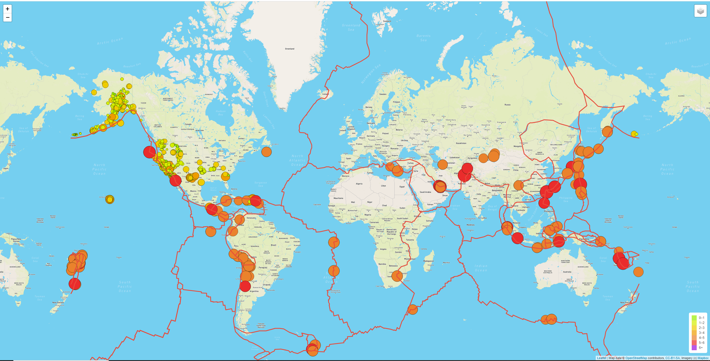
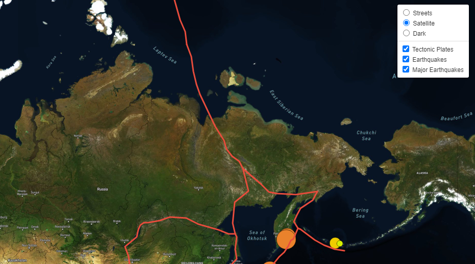

# Mapping_Earthquakes
## Overview
Using geoJSON, APIs, and Leaflet to make maps that show earthquake and fault line locations.
## Functionality
On load, the website looks like this:

The fault lines are in a bright red, while the earthquakes dot the map in colors defined by the legend in the bottom right. The top right offers options to load onto the map:

The major earthquakes option only shows earthquakes with magnitude larger than 4.5.
## Potential Updates
As a base for future analysis or functionality, this page is well set-up. Fun analyses from this map could be exploring the earthquakes not on fault lines and why they occur. Other updates would be including more earthquakes (the current map only goes back a week) or adding more information in the popups.